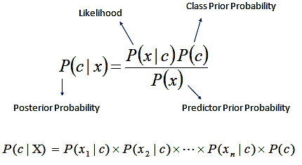

# Spam filter using Python and the multinomial Naive Bayes algorithm from scratch <h1> 
 
**Our goal is to code a spam filter from scratch that classifies messages with an accuracy greater than 80%.**

To build our spam filter, we'll use a dataset of 5,572 SMS messages.
you can download the dataset from https://archive.ics.uci.edu/ml/machine-learning-databases/00228/.

We're going to focus on the Python implementation, so we'll assume that you are already familiar with **multinomial Naive Bayes and conditional proability**.

